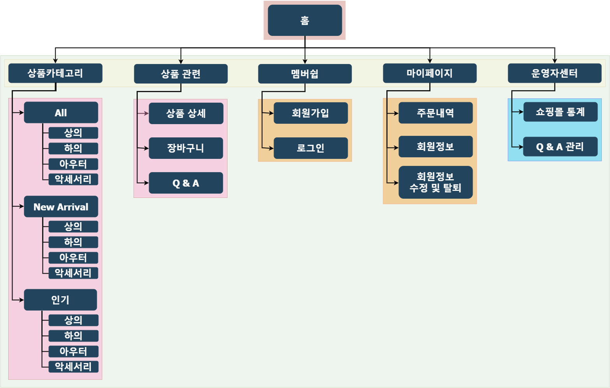
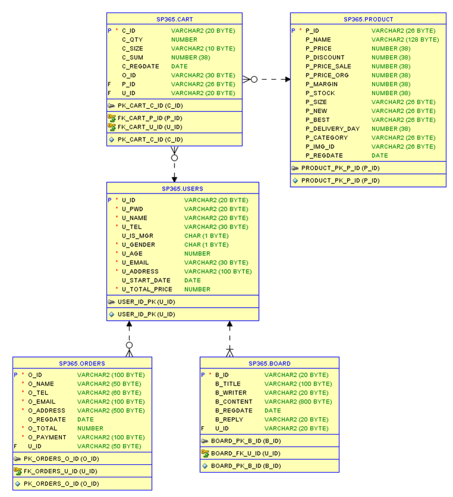
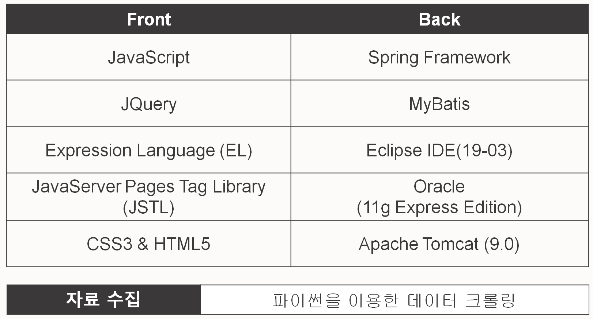

# SP365_쇼핑몰 웹 프로젝트

웹 쇼핑몰 직접 둘러보기 ⇒ [SP365 바로가기](http://15.165.163.102/sp365/main.sp) 

- 쇼핑몰 ID/PW
    - **관리자**
        - ID : admin
        - PW : admin1234
    - **일반 회원**
        - ID : id01
        - PW : test01

편하게 Notion에서 읽기 ⇒ [Notion 바로가기](https://www.notion.so/SP365_-9e57179d516e4649a86b13a5c933df27)

---

## 1. 프로젝트 개요

### 1-1. 내용

**스프링 프레임워크를 활용한 쇼핑몰 웹 어플리케이션** 구축

a. 데이터 크롤링을 활용하여 약 1000가지의 상품을 갖춘 의류 쇼핑몰 구축

b. 쇼핑몰 운영자를 위한 매출 현황 및 고객 응대 페이지 구축

### 1-2. 프로젝트 기간 및 관리

- 기간 : 2019.12.09 (월) ~ 2019.12.27 (금) / 약 3주
- 관리 : 소스코드(Github), 커뮤니케이션 및 일정관리(Trello)

### 1-3. 인원 및 역할

- 조현민

    : 데이터 크롤링, 운영자 관련 기능, 메인 페이지 구현 / DB 설계 및 구축

- 이슬

    : 상품 상세 및 결제 기능, 장바구니 기능 구현 / DB 설계 및 구축

- 최희은

    :  회원 관련(로그인, 회원가입, 마이페이지), 아이템 검색 기능 구현 / DB 설계 및 구축

## 2. 구성 및 기술 스택

### 2-1. 화면 구성도

### 2-2. 시스템 구성도

### 2-3. ERD

### 2-4. 기술 스택

## 3. 상세 기능

[_file/3.5_SP365_.pdf](_file/3.5_SP365_.pdf)

- ! 파일이 안 보이는 경우

    상세 기능 PDF 파일 다운

    [3.5조_SP365_상세기능.pdf](_file/3.5_SP365_%201.pdf)
